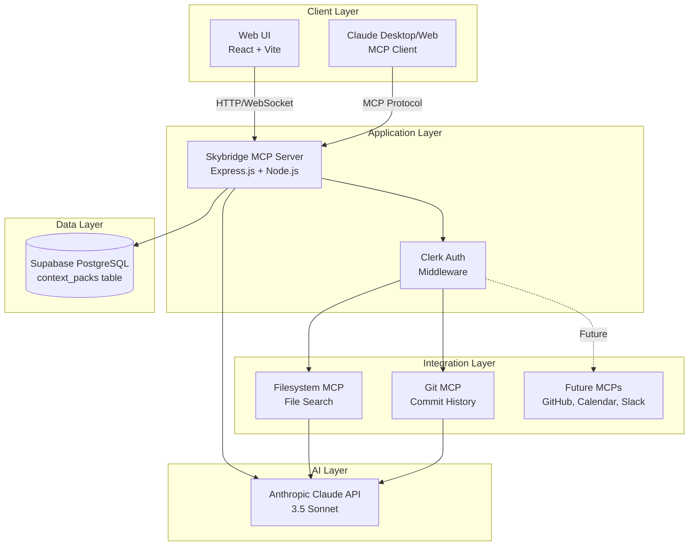
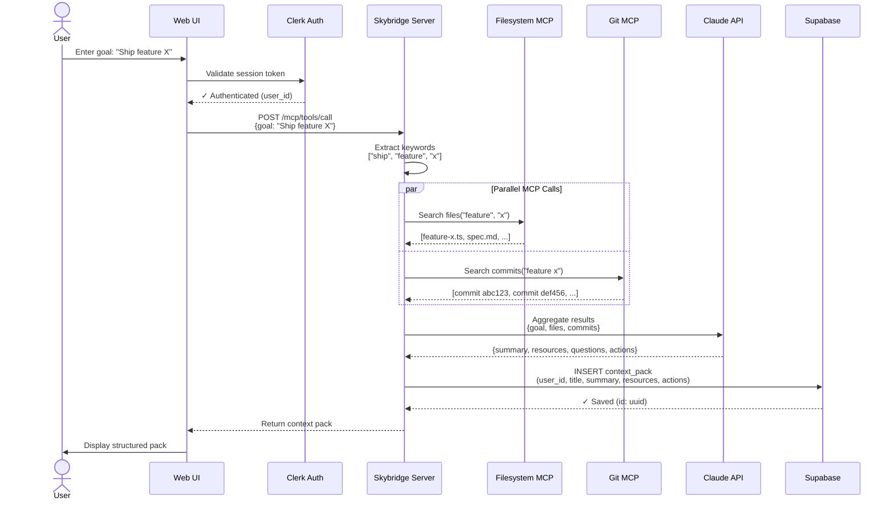
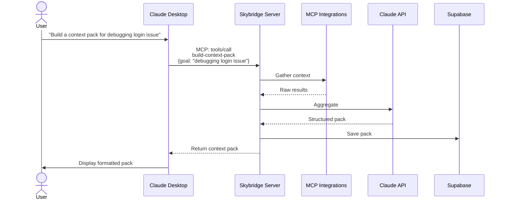

# System Architecture — Context Pack Builder

## Overview

Context Pack Builder is a Model Context Protocol (MCP) application that automatically aggregates contextual information from multiple sources to help developers start tasks quickly. The system orchestrates data gathering from filesystem search, git commit history, and other sources, then uses large language models to intelligently synthesise this information into structured, actionable context packs.

Built on the Skybridge framework, the application serves as both a standalone web interface and an MCP server that Claude can call remotely. It addresses the common workplace problem of "context switching overhead" by reducing the time developers spend manually hunting through codebases, documentation, and git history before starting work on a feature, bug fix, or project review.

## Key Requirements

**Functional Requirements:**
- Accept natural language task descriptions from users
- Search local filesystem for relevant files (code, documentation, configuration)
- Parse git commit history to surface related code changes
- Aggregate results using LLM-powered summarisation
- Persist context packs for future reuse
- Provide both web UI and MCP server interfaces
- Authenticate users and isolate data per user

**Non-Functional Requirements:**
- **Performance**: Generate context packs in under 10 seconds for typical repositories
- **Scalability**: Support multiple concurrent users with isolated data
- **Security**: Enforce row-level security, protect API keys, authenticate all requests
- **Reliability**: Graceful degradation when individual MCP servers fail
- **Extensibility**: Easy to add new MCP integrations (GitHub, Calendar, Slack)
- **Usability**: Simple one-click interface with clear visual feedback

## High-Level Architecture

The system follows a layered architecture with clear separation between presentation, orchestration, data gathering, and persistence layers.



**Architecture Explanation:**

The client layer consists of two interfaces: a web UI for direct user interaction and Claude (desktop or web) acting as an MCP client. Both communicate with the Skybridge MCP Server, which orchestrates all backend operations.

The application layer validates authentication via Clerk middleware before routing requests to appropriate MCP integrations. The integration layer contains modular MCP servers (filesystem, git, and future extensions) that gather raw data. The AI layer (Anthropic Claude API) aggregates and structures this data into coherent summaries. Finally, the data layer persists context packs to Supabase PostgreSQL with row-level security.

This architecture separates concerns cleanly: the client handles presentation, Skybridge handles orchestration and MCP protocol implementation, individual MCPs handle domain-specific data gathering, Claude API adds intelligence, and Supabase ensures durable storage.

## Component Details

### Web Client (React UI)

**Responsibilities:**
- Render user interface for context pack creation
- Display structured context packs (summary, resources, actions)
- Show loading states and error messages
- List previously generated context packs
- Handle user authentication flows via Clerk

**Technologies:**
- React 19 with TypeScript
- Vite 7 (build tool and dev server)
- Lucide React (icon library)
- Custom CSS with gradient theming

**Key Features:**
- Single-page application (SPA)
- Real-time updates via Skybridge hooks
- Responsive design
- Client-side form validation

**Communication:**
- HTTP requests to Skybridge server at `/`
- WebSocket connection for real-time updates (future)
- Clerk SDK for authentication token management

---

### Skybridge MCP Server

**Responsibilities:**
- Implement MCP protocol for Claude integration
- Register and expose the `build-context-pack` tool
- Orchestrate calls to multiple MCP integrations
- Validate input schemas with Zod
- Aggregate results and call Claude API for summarisation
- Save context packs to Supabase
- Serve web UI assets in development

**Technologies:**
- Skybridge framework (v0.31.4)
- Express.js 5
- Node.js 24.13+
- TypeScript
- Zod (schema validation)
- @modelcontextprotocol/sdk

**Important Data:**
- Tool definitions (input/output schemas)
- Widget registrations
- Environment configuration (API keys, database URLs)

**Communication:**
- Exposes `/mcp` endpoint for MCP protocol communication
- Exposes `/` for web UI
- Calls Filesystem MCP, Git MCP via SDK
- Calls Anthropic API via @anthropic-ai/sdk
- Queries Supabase via @supabase/supabase-js

**Key Files:**
- `server/src/server.ts` — Express server setup, widget registration
- `server/src/context-pack.ts` — Core business logic for building context packs
- `server/src/supabase.ts` — Database operations
- `server/src/env.ts` — Environment variable validation

---

### Filesystem MCP

**Responsibilities:**
- Search local filesystem for files matching keywords
- Filter by file type (code, docs, other)
- Return file paths with descriptions
- Handle permission errors gracefully

**Technologies:**
- Node.js fs module
- Path traversal and pattern matching
- File type detection (extensions)

**Important Data:**
- Search keywords extracted from user goal
- File paths relative to project root
- File metadata (size, modification time)

**Communication:**
- Called synchronously by Skybridge server
- Returns array of matched files with paths and descriptions

---

### Git MCP

**Responsibilities:**
- Parse git commit history in local repository
- Search commit messages for relevant keywords
- Extract commit metadata (hash, author, date, message)
- Filter commits by date range (last 30 days default)

**Technologies:**
- Git command-line interface (via child_process)
- Commit parsing and filtering
- Keyword matching algorithms

**Important Data:**
- Git commit hashes
- Commit messages and authors
- Timestamps

**Communication:**
- Called synchronously by Skybridge server
- Returns array of relevant commits with metadata

---

### Anthropic Claude API (LLM Aggregation)

**Responsibilities:**
- Receive raw results from all MCP servers
- Generate coherent 2-sentence summary of task context
- Group resources by type (Code, Docs, Other)
- Generate 3-5 open questions to investigate
- Suggest 3 actionable next steps
- Return structured JSON output

**Technologies:**
- Anthropic API (Claude 3.5 Sonnet)
- @anthropic-ai/sdk (TypeScript client)
- JSON schema validation

**Important Data:**
- Prompt templates for aggregation
- Structured output schemas
- API usage metrics (tokens consumed)

**Communication:**
- REST API calls to api.anthropic.com
- Authenticated via ANTHROPIC_API_KEY
- Returns JSON with fixed structure

---

### Supabase Database

**Responsibilities:**
- Store context packs with user isolation
- Enforce row-level security (RLS) policies
- Provide query interface for fetching past packs
- Handle concurrent writes safely

**Technologies:**
- PostgreSQL 15+
- Supabase platform (hosted PostgreSQL + REST API)
- Row-level security (RLS)
- JSONB columns for flexible data

**Important Data:**
- `context_packs` table:
  - `id` (uuid, primary key)
  - `user_id` (text, indexed)
  - `title` (text) — User's goal description
  - `summary` (text) — LLM-generated summary
  - `resources` (jsonb) — Grouped file/commit references
  - `actions` (jsonb) — Suggested next actions
  - `created_at` (timestamp)

**Communication:**
- REST API via @supabase/supabase-js
- Authenticated via service role key (server-side only)
- RLS policies enforce user_id matching

**Schema:**
```sql
CREATE TABLE context_packs (
  id UUID PRIMARY KEY DEFAULT gen_random_uuid(),
  user_id TEXT NOT NULL,
  title TEXT NOT NULL,
  summary TEXT,
  resources JSONB DEFAULT '{}',
  actions JSONB DEFAULT '[]',
  created_at TIMESTAMPTZ DEFAULT NOW()
);

CREATE INDEX idx_context_packs_user_created
  ON context_packs(user_id, created_at DESC);
```

---

### Clerk Authentication

**Responsibilities:**
- Authenticate users via OAuth (Google, GitHub, email)
- Issue JWT tokens for session management
- Provide user profile information
- Enforce authentication on all protected routes

**Technologies:**
- Clerk platform
- @clerk/express (middleware)
- JWT validation

**Important Data:**
- User IDs (used as foreign keys in Supabase)
- Session tokens
- User metadata (email, name, avatar)

**Communication:**
- Client-side: Clerk frontend SDK redirects to auth flows
- Server-side: Middleware validates JWT tokens on every request
- Syncs user_id to Supabase for RLS

## Data Flow

### Typical Flow: Generate Context Pack



**Flow Explanation:**

1. **User Input**: User enters a task goal in the web UI (e.g., "Ship feature X")
2. **Authentication**: Clerk validates the session token and provides user_id
3. **Request Routing**: UI sends request to Skybridge server's MCP endpoint
4. **Keyword Extraction**: Server extracts search keywords from the goal
5. **Parallel MCP Calls**: Server calls Filesystem MCP and Git MCP concurrently
6. **Result Aggregation**: Raw results are sent to Claude API for intelligent summarisation
7. **Persistence**: Structured context pack is saved to Supabase with user_id
8. **Response**: Server returns complete context pack to UI
9. **Display**: UI renders summary, grouped resources, questions, and actions

**Error Handling:**
- If MCP calls fail, server continues with partial results
- If LLM call fails, server returns basic grouped results without summary
- If database write fails, server still returns context pack to user
- All errors are logged for observability

---

### Alternative Flow: Claude Desktop Integration



When used via Claude Desktop, the MCP protocol handles communication. Claude calls the `build-context-pack` tool, which triggers the same backend flow, but results are returned directly to Claude for rendering in the chat interface.

## Data Model (High-Level)

### Core Entities

**ContextPack**
- Represents a single context aggregation for a task
- Owned by a single user (user_id foreign key)
- Contains structured information: summary, resources, questions, actions
- Immutable once created (no updates, only creates/reads/deletes)

**User** (managed by Clerk, not in our database)
- Authenticated via Clerk
- Referenced by user_id (string) in context_packs table
- Profile data (email, name) stored in Clerk

**Resource** (embedded in ContextPack.resources JSONB)
- File path or git commit reference
- Type: "code" | "docs" | "other"
- Description: human-readable explanation

**Action** (embedded in ContextPack.actions JSONB)
- Suggested next step
- Plain text string

### Entity Relationships

```
User (Clerk) 1 ─── * ContextPack
                    │
                    └─── resources[] (JSONB array)
                    └─── actions[] (JSONB array)
```

**Rationale:**
- JSONB columns provide flexibility for varying resource types (filesystem, git, future integrations)
- Denormalised structure optimises for read performance (no joins needed)
- User data stays in Clerk to avoid duplication and sync issues

## Infrastructure & Deployment

### Deployment Architecture

**Production (Alpic Platform):**
```
┌─────────────────────────────────────────┐
│         Alpic Cloud Platform            │
│  ┌───────────────────────────────────┐  │
│  │   Container (Node.js 24)          │  │
│  │   - Skybridge Server (Express)    │  │
│  │   - Static assets (Vite build)    │  │
│  └───────────────────────────────────┘  │
│                                          │
│  Exposed Endpoints:                      │
│  - https://app-name.alpic.live/         │
│  - https://app-name.alpic.live/mcp      │
└─────────────────────────────────────────┘
         │                    │
         │                    │
         ▼                    ▼
   Supabase Cloud      Clerk Auth
   (PostgreSQL)        (OAuth)
```

**Local Development:**
```
┌─────────────────────────────────────────┐
│     Developer Machine (localhost:3000)  │
│  ┌───────────────────────────────────┐  │
│  │   Skybridge Dev Server            │  │
│  │   - Hot reload (nodemon)          │  │
│  │   - Vite dev server (HMR)         │  │
│  └───────────────────────────────────┘  │
│                                          │
│  Cloudflared Tunnel (optional):          │
│  https://xxx.trycloudflare.com/mcp       │
└─────────────────────────────────────────┘
```

### Environments

| Environment | Purpose | URL | Database |
|-------------|---------|-----|----------|
| **Development** | Local development with hot reload | http://localhost:3000 | Supabase project (dev) |
| **Staging** | Pre-production testing | https://staging.alpic.live | Supabase project (staging) |
| **Production** | Live user traffic | https://app-name.alpic.live | Supabase project (prod) |

**Key Differences:**
- **Development**: Uses `pnpm dev`, enables debug logging, no HTTPS required
- **Staging**: Built with `pnpm build`, uses production-like env vars, tests Alpic deployment
- **Production**: Optimised builds, strict error handling, rate limiting enabled

### CI/CD Pipeline

**Alpic Deployment (Automated):**
1. Push to GitHub repository
2. Alpic detects changes via webhook
3. Builds Docker container with Node.js 24
4. Runs `pnpm install && pnpm build`
5. Starts server with `pnpm start`
6. Health check on `/` endpoint
7. Zero-downtime deployment (blue-green strategy)

**Manual Deployment:**
```bash
# Build locally
pnpm build

# Deploy to Alpic
pnpm deploy
```

## Scalability & Reliability

### Scalability Strategies

**Horizontal Scaling:**
- Alpic platform auto-scales containers based on CPU/memory usage
- Stateless server design allows multiple instances to run concurrently
- Database connection pooling (Supabase handles this)

**Vertical Scaling:**
- Increase container resources (CPU, RAM) for higher throughput
- Upgrade Supabase plan for more database capacity

**Caching (Future):**
- Cache filesystem search results (expires on file changes)
- Cache git commit data (expires on new commits)
- Redis or in-memory cache for frequently accessed packs

### Reliability Measures

**Graceful Degradation:**
- If Filesystem MCP fails → continue with Git MCP results only
- If Git MCP fails → continue with Filesystem results only
- If Claude API fails → return basic grouped results without LLM summary
- If Supabase write fails → still return pack to user (log error for retry)

**Error Handling:**
- All external API calls wrapped in try/catch
- Fallback values for missing data
- User-friendly error messages in UI

**Health Monitoring:**
- `/health` endpoint returns server status
- Periodic checks to Supabase, Clerk, Anthropic APIs
- Alerts on consecutive failures

**Backup & Recovery:**
- Supabase automatic daily backups (point-in-time recovery)
- Database migration history in version control
- Environment variables stored securely in Alpic

## Security & Compliance

### Authentication & Authorisation

**Authentication (Clerk):**
- OAuth 2.0 flows (Google, GitHub, email/password)
- JWT tokens with expiration (1 hour default)
- Refresh token rotation
- Multi-factor authentication (MFA) support

**Authorisation:**
- Row-level security (RLS) in Supabase
- Users can only read/write their own context_packs
- Server validates user_id from JWT on every request

**RLS Policies:**
```sql
-- Users can only select their own packs
CREATE POLICY "Users can read own packs"
  ON context_packs FOR SELECT
  USING (auth.uid()::text = user_id);

-- Users can only insert with their own user_id
CREATE POLICY "Users can insert own packs"
  ON context_packs FOR INSERT
  WITH CHECK (auth.uid()::text = user_id);
```

### Secrets Management

**Environment Variables:**
- Stored in `.env` file (gitignored)
- Injected into containers via Alpic platform
- Never committed to version control

**API Keys:**
- `SUPABASE_SERVICE_ROLE_KEY` — server-side only, never exposed to client
- `ANTHROPIC_API_KEY` — server-side only, used for LLM calls
- `CLERK_SECRET_KEY` — server-side only, validates JWT tokens
- `CLERK_PUBLISHABLE_KEY` — client-side safe, public key for auth flows

### Data Protection

**Encryption:**
- TLS/HTTPS for all communication (enforced by Alpic)
- Supabase encrypts data at rest
- JWT tokens signed with strong secrets

**Data Retention:**
- Context packs stored indefinitely (user can delete)
- Logs retained for 30 days
- No PII stored beyond user_id (email in Clerk only)

**GDPR Compliance:**
- Users can delete their context packs (future feature)
- User data export available via Supabase query
- Right to erasure: delete user in Clerk + cascade delete packs

### Rate Limiting (Future)

- Limit context pack generation to 10/minute per user
- Anthropic API has built-in rate limits (tier-based)
- Supabase connection pooling prevents database overload

## Observability

### Logging

**Application Logs:**
- Console logs in development (`console.log`, `console.error`)
- Structured JSON logs in production (Winston or Pino)
- Log levels: `DEBUG`, `INFO`, `WARN`, `ERROR`

**Log Sources:**
- Server startup/shutdown events
- MCP tool calls (input/output)
- External API errors (Anthropic, Supabase)
- Authentication failures
- Database query performance

**Log Storage:**
- Development: stdout/stderr
- Production: Alpic platform log aggregation (viewable in dashboard)
- Future: Forward to Datadog, LogRocket, or similar

### Metrics (Future)

**Key Metrics to Track:**
- Request rate (requests per second)
- Context pack generation latency (p50, p95, p99)
- MCP call success/failure rates
- LLM API token usage
- Database query performance
- Active users (DAU/MAU)

**Monitoring Tools:**
- Alpic platform metrics (CPU, memory, requests)
- Supabase dashboard (query performance, connections)
- Anthropic API dashboard (token usage, rate limits)

### Tracing (Future)

**Distributed Tracing:**
- OpenTelemetry instrumentation
- Trace full request lifecycle: UI → Server → MCPs → LLM → DB
- Visualise bottlenecks and slow queries

**Error Tracking:**
- Sentry or similar for frontend errors
- Server-side error reporting with stack traces
- Automated alerting on critical errors

## Trade-offs & Decisions

### Key Design Decisions

**1. Skybridge Framework vs. Custom MCP Server**
- **Decision**: Use Skybridge
- **Rationale**: Provides MCP protocol implementation, widget system, and rapid development
- **Trade-off**: Less control over low-level MCP behaviour, framework lock-in
- **Alternative Considered**: Build custom MCP server with @modelcontextprotocol/sdk
- **Why Chosen**: 90-minute hackathon time constraint favoured batteries-included framework

**2. Supabase vs. Self-Hosted PostgreSQL**
- **Decision**: Use Supabase
- **Rationale**: Managed PostgreSQL with built-in auth (RLS), REST API, real-time subscriptions
- **Trade-off**: Vendor lock-in, monthly cost, less control over database configuration
- **Alternative Considered**: Self-hosted PostgreSQL on Render/Fly.io
- **Why Chosen**: Faster setup, RLS reduces auth complexity, free tier sufficient for MVP

**3. Clerk vs. Supabase Auth vs. Custom Auth**
- **Decision**: Use Clerk
- **Rationale**: Best-in-class OAuth experience, pre-built UI components, JWT management
- **Trade-off**: Additional vendor dependency, cost scales with users
- **Alternative Considered**: Supabase Auth (simpler stack), Auth0 (enterprise features)
- **Why Chosen**: Starter template already integrated Clerk, excellent developer experience

**4. Anthropic API (Server-Side) vs. Client-Side LLM Calls**
- **Decision**: Call Anthropic API from server
- **Rationale**: Protects API key, allows prompt engineering, enables caching/retry logic
- **Trade-off**: Server becomes bottleneck, costs scale with usage
- **Alternative Considered**: Client-side calls (cheaper, faster), local LLM (privacy)
- **Why Chosen**: Security (API key protection), quality (server can optimise prompts)

**5. JSONB for Resources vs. Normalised Tables**
- **Decision**: Use JSONB columns for `resources` and `actions`
- **Rationale**: Flexible schema, supports varying resource types (filesystem, git, future MCPs)
- **Trade-off**: Harder to query specific resource types, no foreign key constraints
- **Alternative Considered**: Separate tables (`resources`, `actions`) with foreign keys
- **Why Chosen**: MVP flexibility, fewer migrations needed for new MCP integrations

**6. Synchronous MCP Calls vs. Asynchronous Job Queue**
- **Decision**: Synchronous calls in initial version
- **Rationale**: Simpler implementation, acceptable latency for MVP (<10 seconds)
- **Trade-off**: Blocks server thread, cannot handle very long-running tasks
- **Alternative Considered**: Redis + Bull queue for async processing
- **Why Chosen**: Faster MVP delivery, can migrate to async in future if needed

## Future Improvements

### Short-Term (Next 3 Months)

**1. Additional MCP Integrations**
- GitHub MCP: Search issues, PRs, code directly via GitHub API
- Calendar MCP: Find related meetings and events
- Slack MCP: Search message threads and channels
- Email MCP: Surface important email threads

**2. Enhanced Error Handling**
- Retry logic for transient API failures
- Better user-facing error messages
- Fallback to cached results when APIs are down

**3. Performance Optimisations**
- Cache filesystem search results (invalidate on file changes)
- Parallel LLM calls for large result sets
- Database query optimisation (add indexes for common queries)

**4. CRUD Operations**
- Edit context pack titles and summaries
- Delete individual context packs
- Archive old packs (soft delete)

### Medium-Term (3-6 Months)

**5. Team Collaboration**
- Share context packs with team members
- Team workspaces with shared access
- Comments and annotations on packs

**6. Search & Filtering**
- Full-text search across saved context packs
- Filter by date, tags, or project
- Autocomplete for task descriptions

**7. Analytics & Insights**
- Track which resources are most useful over time
- Identify common task patterns
- Suggest related context packs

**8. Export & Integration**
- Export packs as Markdown files
- Notion/Confluence integration (push context packs to docs)
- Slack bot for triggering pack generation

### Long-Term (6-12 Months)

**9. Advanced AI Features**
- Multi-step task planning (break down goals into sub-tasks)
- Automated action execution (create calendar events, draft emails)
- Context pack versioning (track how understanding evolves)

**10. Mobile Application**
- React Native app for iOS/Android
- Offline mode with local caching
- Push notifications for shared packs

**11. Enterprise Features**
- SSO (SAML, OIDC)
- Audit logs for compliance
- Custom MCP plugin marketplace
- On-premises deployment option

**12. Scalability Enhancements**
- Migrate to microservices architecture (split MCP orchestrator from web server)
- Redis caching layer for hot paths
- Event-driven architecture with message queues (Kafka, RabbitMQ)
- Horizontal auto-scaling based on queue depth

---

**Document Version**: 1.0
**Last Updated**: 2026-02-20
**Maintained By**: Context Pack Builder Team
**Contact**: support@alpic.ai
