# Context Pack Builder
> Aggregate context from multiple sources in one click—save 15 minutes of manual research before starting any task

[](LICENSE)
[](https://nodejs.org/)
[](https://docs.skybridge.tech)
[](https://claude.ai)

## Description

**Context Pack Builder** is an MCP (Model Context Protocol) app that automatically gathers all the context you need before starting any task. Instead of manually hunting through code repositories, documentation, git history, and calendars, simply describe your goal and let the app build a comprehensive context pack in seconds.

Built for software developers, project managers, and anyone who needs to quickly ramp up on a task, feature, or bug fix. Solves the universal workplace problem of "where do I even start?" by aggregating relevant files, commits, meetings, and documents into one organized view.

Perfect for:
- Starting work on a new feature
- Debugging incidents
- Preparing for code reviews
- Onboarding to unfamiliar projects
- Planning sprints or quarterly work

## Table of Contents

- [Features](#features)
- [Tech Stack](#tech-stack)
- [Architecture Overview](#architecture-overview)
- [Installation](#installation)
- [Usage](#usage)
- [Configuration](#configuration)
- [Screenshots / Demo](#screenshots--demo)
- [API / CLI Reference](#api--cli-reference)
- [Tests](#tests)
- [Roadmap](#roadmap)
- [Contributing](#contributing)
- [License](#license)
- [Contact / Support](#contact--support)

## Features

- **🎯 One-Click Context Aggregation** — Enter a task description like "Ship feature X" and get all relevant context in seconds
- **📁 Filesystem Search** — Automatically finds relevant files (code, docs, configs) via MCP filesystem integration
- **🔀 Git History Analysis** — Searches commit messages and diffs to surface related code changes
- **🤖 LLM-Powered Summarization** — Claude API intelligently aggregates results into structured sections
- **💾 Persistent Storage** — Save context packs to Supabase for reuse and historical reference
- **🎨 Beautiful UI** — Clean, purple-gradient themed interface with grouped resources and loading states
- **🔐 Secure Authentication** — Clerk-based auth with row-level security (RLS) in Supabase
- **🔧 Extensible Architecture** — Easy to add more MCP servers (GitHub, Calendar, Slack, Email)


## Tech Stack

**Frontend:**
- React 19 with TypeScript
- Vite 7 (build tool & dev server)
- Lucide React (icons)
- Custom CSS with gradient theming

**Backend:**
- Skybridge (MCP server framework)
- Express.js 5
- Node.js 24.13+
- TypeScript

**MCP Integrations:**
- Model Context Protocol SDK
- Filesystem MCP (file search)
- Git MCP (commit history)

**Database & Auth:**
- Supabase (PostgreSQL with RLS)
- Clerk (authentication & user management)

**AI/LLM:**
- Anthropic Claude 3.5 Sonnet API
- Zod (schema validation)

**DevOps:**
- pnpm (package management)
- Alpic (deployment platform)
- Cloudflared (local tunneling for testing)

## Architecture Overview

```mermaid
flowchart TB
    User[👤 User] --> Widget[React Widget<br/>build-context-pack]
    Widget --> McpServer[Skybridge MCP Server<br/>context.buildPack]

    McpServer --> FsMcp[Filesystem MCP<br/>Search Files]
    McpServer --> GitMcp[Git MCP<br/>Search Commits]
    McpServer --> LLM[Claude API<br/>Aggregate & Structure]

    FsMcp --> Results[Raw Results]
    GitMcp --> Results
    Results --> LLM

    LLM --> Supabase[(Supabase DB<br/>context_packs)]
    Supabase --> Widget

    Clerk[Clerk Auth] -.->|Authenticate| User
    Widget --> Display[Context Pack Display<br/>Summary • Resources • Actions]
```



### How It Works

1. **User Input**: User enters a task goal (e.g., "Debug login timeout issue") in the widget
2. **MCP Orchestration**: Server calls multiple MCP tools in parallel:
   - **Filesystem MCP** searches for files matching keywords (e.g., "login", "timeout", "auth")
   - **Git MCP** queries commit history for related code changes
3. **LLM Aggregation**: Claude API receives all raw results and generates:
   - 2-sentence summary of the task context
   - Grouped resources (Code, Docs, Other)
   - 3-5 open questions to investigate
   - 3 suggested next actions
4. **Storage**: Context pack is saved to Supabase with user_id for future reuse
5. **Display**: Widget renders structured sections with links, summaries, and actionable items

This architecture separates concerns clearly: the frontend handles user interaction, the MCP server orchestrates data gathering, external MCPs provide raw data, the LLM adds intelligence, and Supabase ensures persistence.

## Installation

### Prerequisites

Before installing, ensure you have:

- **Node.js** v24.13+ ([Download](https://nodejs.org))
  - macOS: `brew install node`
  - Linux/Windows: [nodejs.org/en/download](https://nodejs.org/en/download)
- **pnpm** ([Install Guide](https://pnpm.io/installation))
  ```bash
  npm install -g pnpm
  ```
- **Supabase CLI** ([Getting Started](https://supabase.com/docs/guides/cli/getting-started))
  - macOS: `brew install supabase/tap/supabase`
  - Other: See Supabase docs
- **Supabase Project** ([Create Project](https://supabase.com/dashboard))
  - You'll need: `SUPABASE_URL` and `SUPABASE_SERVICE_ROLE_KEY`
- **Clerk Project** ([Create Project](https://clerk.com/dashboard))
  - You'll need: `CLERK_SECRET_KEY` and `CLERK_PUBLISHABLE_KEY`
- **Anthropic API Key** ([Get API Key](https://console.anthropic.com/settings/keys))
  - You'll need: `ANTHROPIC_API_KEY`

### Step-by-Step Setup

**1. Clone the repository**

```bash
git clone https://github.com/alpic-ai/claude-hacknight-starter-20-02-2026.git context-pack-builder
cd context-pack-builder
```

**2. Install dependencies**

```bash
pnpm install
```

This installs ~342 packages including React, Vite, Skybridge, Supabase client, Clerk, and Anthropic SDK.

**3. Configure environment variables**

```bash
cp .env.example .env
```

Edit `.env` and add your API keys:

```env
# Supabase (https://supabase.com/dashboard)
SUPABASE_URL=https://your-project-id.supabase.co
SUPABASE_SERVICE_ROLE_KEY=your-service-role-key

# Clerk (https://dashboard.clerk.com)
CLERK_SECRET_KEY=sk_test_xxxxx
CLERK_PUBLISHABLE_KEY=pk_test_xxxxx

# Anthropic (https://console.anthropic.com/settings/keys)
ANTHROPIC_API_KEY=sk-ant-xxxxx
```

**4. Link your Supabase project**

```bash
supabase link --project-ref your-project-ref
```

You can find your project ref in the Supabase dashboard URL.

**5. Push database migrations**

```bash
supabase db push
```

This creates the `context_packs` table with the following schema:
- `id` (uuid, primary key)
- `user_id` (text, indexed)
- `title` (text)
- `summary` (text)
- `resources` (jsonb)
- `actions` (jsonb)
- `created_at` (timestamp)

**6. Start the development server**

```bash
pnpm dev
```

The app runs at `http://localhost:3000`. Open this URL to use the Skybridge devtools for testing.

## Usage

### Running Locally

**Start the dev server:**

```bash
pnpm dev
```

Open [http://localhost:3000](http://localhost:3000) in your browser to access the Skybridge devtools interface.

### Testing with Claude

To connect your local server to Claude Desktop or Claude Web:

**1. Tunnel your local server** (exposes `/mcp` endpoint):

```bash
cloudflared tunnel --url http://localhost:3000
```

This returns a temporary URL like `https://xxx.trycloudflare.com`.

**2. Add as MCP server in Claude:**

- Open Claude settings → MCP servers
- Add remote server: `https://xxx.trycloudflare.com/mcp`
- Requires Claude Pro, Team, Max, or Enterprise

**3. Test in Claude:**

```
Build a context pack for "Ship authentication feature"
```

Claude will call the MCP server, which searches your filesystem and git history, aggregates results with the LLM, and returns a structured context pack.

### Example Workflow

**Input (in widget or via Claude):**

```
Ship feature X
```

**Output (context pack):**

```
Summary:
Feature X adds real-time notifications to the dashboard.
Last work was done on branch feature/notifications, with
8 commits merged 3 days ago.

Code:
- src/feature-x.ts (111 lines)
- src/feature-x.test.ts (126 lines)

Docs:
- docs/spec.md (Feature X specifications)
- docs/design.md (Architecture and design decisions)

Git History:
- commit abc123: "Add notification service" (3 days ago)
- commit def456: "Update dashboard UI" (2 days ago)

Open Questions:
1. What is the rollout timeline for production?
2. Are there any known edge cases with Safari?
3. Who owns the integration testing?

Next Actions:
1. Review PR #12 for final approval
2. Confirm QA owner for end-to-end testing
3. Schedule rollout meeting with product team
```

### Building for Production

```bash
pnpm build
pnpm start
```

Or deploy directly to [Alpic](https://alpic.ai):

[](https://app.alpic.ai/new/clone?repositoryUrl=https%3A%2F%2Fgithub.com%2Falpic-ai%2Fclaude-hacknight-starter-20-02-2026)

## Configuration

### Environment Variables

All configuration is done via `.env` file:

| Variable | Description | Required | Example |
|----------|-------------|----------|---------|
| `SUPABASE_URL` | Your Supabase project URL | ✅ | `https://abc123.supabase.co` |
| `SUPABASE_SERVICE_ROLE_KEY` | Supabase service role key (Settings → API) | ✅ | `eyJhbGci...` |
| `CLERK_SECRET_KEY` | Clerk secret key for server-side auth | ✅ | `sk_test_xxxxx` |
| `CLERK_PUBLISHABLE_KEY` | Clerk publishable key for client-side | ✅ | `pk_test_xxxxx` |
| `ANTHROPIC_API_KEY` | Anthropic API key for Claude | ✅ | `sk-ant-xxxxx` |

### MCP Server Configuration

The app uses two MCP servers by default:

**Filesystem MCP** — Searches local files by keyword
- Configured in `server/src/context-pack.ts`
- Default: searches in current working directory
- Customizable via `searchPath` parameter

**Git MCP** — Parses git commit history
- Configured in `server/src/context-pack.ts`
- Default: searches commits in last 30 days
- Customizable via `since` parameter

To add more MCP servers (GitHub, Calendar, Slack), see [Adding New MCPs](#roadmap) in the Roadmap section.

### Supabase RLS Policies

Row-level security ensures users only see their own context packs:

```sql
-- Users can only read their own packs
CREATE POLICY "Users can read own packs"
  ON context_packs FOR SELECT
  USING (auth.uid()::text = user_id);

-- Users can only insert their own packs
CREATE POLICY "Users can insert own packs"
  ON context_packs FOR INSERT
  WITH CHECK (auth.uid()::text = user_id);
```
## Video Demo

https://youtu.be/D_D2Vei1Jcs


## Screenshots / Demo

### 1. Widget Interface

_Placeholder: Screenshot of the build-context-pack widget with input field and "Build Context Pack" button._


### 2. Context Pack Display

_Placeholder: Screenshot showing a rendered context pack with summary, grouped resources, open questions, and next actions._


### 3. Past Packs List

_Placeholder: Screenshot of the past packs history showing previously generated context packs._


### Live Demo

**Try it now in Claude:**

Add `https://context-pack-builder.alpic.live/mcp` as a remote MCP server in your Claude settings (requires Pro, Team, Max, or Enterprise).

Then ask Claude:
```
Build a context pack for debugging the login flow
```

_Note: Replace with actual deployment URL once deployed._

## API / CLI Reference

### MCP Tool: `build-context-pack`

**Tool Name:** `build-context-pack`

**Input Schema:**

```typescript
{
  goal: string; // Task description (e.g., "Ship feature X")
}
```

**Output Schema:**

```typescript
{
  summary: string;        // 2-sentence summary
  resources: {
    code: Array<{ path: string; description: string }>;
    docs: Array<{ path: string; description: string }>;
    other: Array<{ path: string; description: string }>;
  };
  openQuestions: string[]; // 3-5 questions to investigate
  nextActions: string[];   // 3 suggested actions
}
```

**Example Claude Prompt:**

```
Use the build-context-pack tool to gather context for "fixing memory leak in Node.js service"
```

**Example cURL (direct API call):**

```bash
curl -X POST https://context-pack-builder.alpic.live/mcp \
  -H "Content-Type: application/json" \
  -H "Authorization: Bearer YOUR_CLERK_TOKEN" \
  -d '{
    "method": "tools/call",
    "params": {
      "name": "build-context-pack",
      "arguments": {
        "goal": "Prepare Q2 planning review"
      }
    }
  }'
```

## Tests

**Test Framework:** _Not yet implemented_

To add tests (recommended for production):

```bash
# Install test dependencies
pnpm add -D vitest @testing-library/react @testing-library/jest-dom

# Run tests
pnpm test
```

**Suggested test coverage:**
- Unit tests for `context-pack.ts` functions (buildContextPack, callFilesystemMcp, callGitMcp, aggregateWithLLM)
- Integration tests for MCP server endpoints
- Component tests for React widgets (build-context-pack.tsx, ContextPackDisplay.tsx)
- E2E tests for full user flow (input → MCP → LLM → Supabase → display)

## Roadmap

### ✅ Completed (MVP + Stretch Goals)
- [x] Filesystem MCP integration
- [x] Git MCP integration
- [x] LLM aggregation with Claude API
- [x] Supabase persistence
- [x] Beautiful UI with loading states
- [x] Past packs history
- [x] Demo materials and script

### 🔜 Planned Features

**High Priority:**
- [ ] **GitHub MCP integration** — Search issues, PRs, and code directly from GitHub API
- [ ] **Calendar MCP** — Find related meetings and events
- [ ] **Slack/Teams MCP** — Search relevant message threads and channels
- [ ] **Email MCP** — Surface important email threads with stakeholders

**Medium Priority:**
- [ ] **Edit/Delete Packs** — CRUD operations for managing saved context packs
- [ ] **Share Packs** — Generate shareable links for team collaboration
- [ ] **Export to Markdown** — Download context packs as .md files
- [ ] **Tag System** — Organize packs by project, type, or custom tags
- [ ] **Search Packs** — Full-text search across saved context packs

**Low Priority:**
- [ ] **Team Workspaces** — Shared context packs for entire teams
- [ ] **Analytics** — Track which resources are most useful over time
- [ ] **Custom MCP Plugins** — Allow users to add their own MCP servers
- [ ] **Mobile App** — React Native version for iOS/Android

## Contributing

We welcome contributions! Here's how to get started:

### Reporting Issues

Found a bug or have a feature request?

1. Check [existing issues](https://github.com/alpic-ai/claude-hacknight-starter-20-02-2026/issues) first
2. If not found, [open a new issue](https://github.com/alpic-ai/claude-hacknight-starter-20-02-2026/issues/new)
3. Provide:
   - Clear title and description
   - Steps to reproduce (for bugs)
   - Expected vs. actual behavior
   - Environment details (Node version, OS, browser)

### Pull Requests

**Process:**

1. Fork the repository
2. Create a feature branch: `git checkout -b feature/your-feature-name`
3. Make your changes following our code style:
   - TypeScript for all code
   - ESLint + Prettier for formatting
   - Meaningful variable names
   - Comments for complex logic
4. Test your changes locally (`pnpm dev`)
5. Commit with clear messages: `git commit -m "Add calendar MCP integration"`
6. Push to your fork: `git push origin feature/your-feature-name`
7. Open a PR against `main` branch

**Guidelines:**
- Keep PRs focused (one feature/fix per PR)
- Update README if adding new features
- Add migrations for database changes
- Test with Claude Desktop before submitting

## License

This project is licensed under the **MIT License**.

See [LICENSE](LICENSE) file for full details.

```
MIT License

Copyright (c) 2026 Context Pack Builder Contributors

Permission is hereby granted, free of charge, to any person obtaining a copy
of this software and associated documentation files (the "Software"), to deal
in the Software without restriction, including without limitation the rights
to use, copy, modify, merge, publish, distribute, sublicense, and/or sell
copies of the Software, and to permit persons to whom the Software is
furnished to do so, subject to the following conditions:

[Full MIT License text...]
```

## Contact / Support

### Maintainer

**Context Pack Builder Team**
- GitHub: [@alpic-ai](https://github.com/alpic-ai)
- Website: [alpic.ai](https://alpic.ai)
- Email: support@alpic.ai

### Community

- **Issues & Bugs:** [GitHub Issues](https://github.com/alpic-ai/claude-hacknight-starter-20-02-2026/issues)
- **Feature Requests:** [GitHub Discussions](https://github.com/alpic-ai/claude-hacknight-starter-20-02-2026/discussions)
- **Slack:** Join the [Alpic Community Slack](https://alpic.ai/slack) (placeholder link)

### Resources

- [Skybridge Documentation](https://docs.skybridge.tech/)
- [Model Context Protocol Docs](https://modelcontextprotocol.io/)
- [Anthropic Claude API Docs](https://docs.anthropic.com/)
- [Supabase Documentation](https://supabase.com/docs)
- [Clerk Authentication Docs](https://clerk.com/docs)

---

**Built with ❤️ using [Claude Code](https://claude.com/claude-code), [Skybridge](https://docs.skybridge.tech), and the [Model Context Protocol](https://modelcontextprotocol.io/)**

**Winner of Alpic AI Hack Night** (February 20, 2026)
